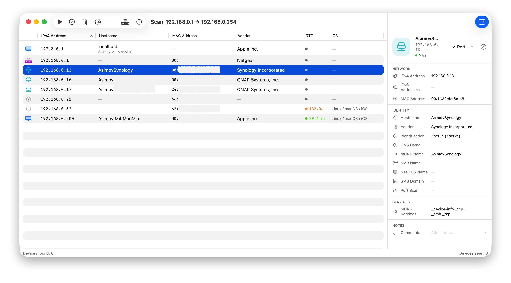
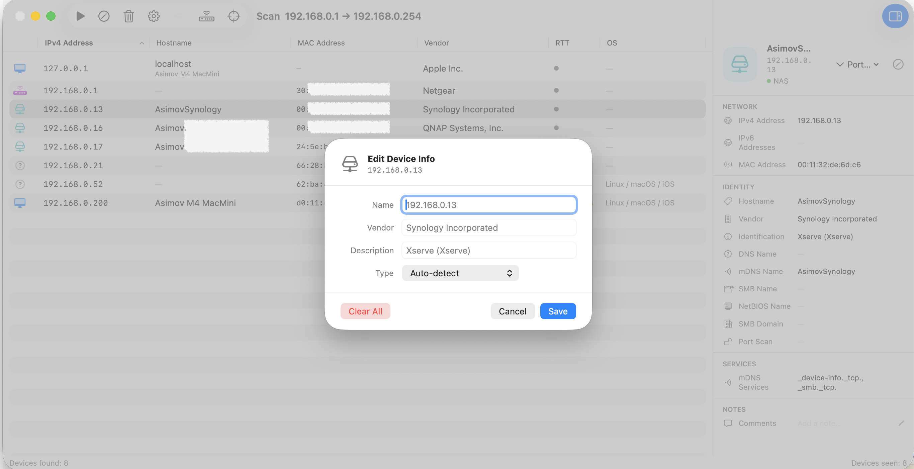

# NetScan

A native macOS LAN scanner built with Swift and SwiftUI.

NetScan discovers every device on your local network (and optionally an upstream subnet), then enriches each result with hostname, vendor, device type, open ports, and Bonjour/mDNS identity — all without any third-party dependencies.

---

## Features

### Discovery
| Method | What it finds |
|---|---|
| **Ping sweep** | Alive hosts, round-trip time, TTL |
| **ARP** | MAC addresses for all live hosts |
| **NDP** | IPv6 link-local and global addresses |
| **Bonjour / mDNS** | Apple device names, model identifiers, service types |
| **SSDP / UPnP** | Vendor and product names for smart-home & NAS devices |
| **HTTP banner** | Web admin page title/content for NAS, routers, printers |
| **Reverse DNS** | Hostnames via the configured DNS server |
| **Port scan** | Common TCP ports (optional; off by default) |

### Identification
- Automatic device-type classification: Mac, MacBook, iPhone, iPad, Apple TV, HomePod, Windows PC, Linux, Router, NAS, Printer, Smart TV, IoT, Unknown
- OUI-based vendor lookup (Synology, QNAP, WD, TP-Link, ASUS, Netgear, …)
- Apple model identifier mapping (`Mac16,11` → Mac mini M4 Pro, etc.)
- TTL-based OS hints and gateway-IP heuristics for remote-subnet devices

### Upstream network
- Discover the upstream router via traceroute (**Expand** button)
- Scan a custom IP range with the upstream subnet pre-filled (**Range…** button)

### UI
- Live device list sorted by IP, with real-time search/filter
- Toggle-able detail panel (network info, identity, ports, comments)
- Edit device name, vendor, description, and type per device
- Scan progress bar and status messages

---

## Screenshots





---

## Download

The latest release is available on the [Releases](https://github.com/K-Asimov/netscan/releases) page as a ready-to-run DMG.

1. Download `NetScan-<version>.dmg` from the latest release
2. Open the DMG and drag **NetScan.app** to Applications
3. Launch NetScan — macOS may prompt to allow it on first run (**System Settings → Privacy & Security → Open Anyway**)

> **Note:** The app is ad-hoc signed (not notarized). macOS Gatekeeper will show a warning on first launch.

---

## Requirements

| | Minimum |
|---|---|
| macOS | **14.0 Sonoma** |
| Xcode | **15.0** |
| Swift | **5.9** |

> **Note:** NetScan requires that the App Sandbox be **disabled** so it can run system binaries (`/sbin/ping`, `/usr/sbin/arp`, `/usr/bin/dns-sd`, `/usr/sbin/traceroute`, …).

---

## How it works

### Phase 1 — Ping sweep
Hosts are pinged concurrently in batches of 50. Each alive host is added to the table immediately as it is found, with RTT and TTL captured from the ICMP reply.

### Phase 2 — Metadata enrichment
While the ping sweep runs, four metadata collectors are started in parallel:

| Collector | Implementation |
|---|---|
| ARP table | `arp -a -n` snapshot + per-host `arp -n <ip>` |
| NDP table | `ndp -a -n` for IPv6 ↔ MAC mapping |
| SSDP | UDP multicast to `239.255.255.250:1900`, M-SEARCH |
| Bonjour | `NetServiceBrowser` + `dns-sd` CLI fallback |

After the ping sweep completes, every discovered IP is enriched with the collected metadata. Devices found only by SSDP or Bonjour (but not alive via ping) are also added with `pingStatus = .unknown`.

### Phase 3 — Background enrichment
For each live host, the view model concurrently runs:
- Reverse DNS lookup (`getnameinfo`)
- HTTP banner scan (ports 80, 443, 8080, 5000, 5001)
- Port scan (if enabled)

### Bonjour policy workaround
macOS denies `NetServiceBrowser` access to Apple proprietary service types (`_companion-link._tcp`, `_airplay._tcp`, `_apple-mobdev2._tcp`, …) for unsigned/non-entitled apps, returning `kDNSServiceErr_PolicyDenied` (−72008).

NetScan bypasses this by spawning `/usr/bin/dns-sd` as a subprocess — a system binary that is not subject to the same policy. All service types are browsed in parallel using `DispatchQueue.concurrentPerform`, and instances are resolved to IPv4 addresses (with loopback skipped so the local machine maps to its LAN IP, not `127.0.0.1`).

### Upstream subnet scanning
Clicking **Expand** runs `traceroute -n -q 1 -m 3 1.1.1.1` to find the second hop (the upstream router), then scans just that IP and appends it to the current device list.

Clicking **Range…** opens a dialog pre-filled with the upstream subnet range (`192.168.1.1–254`) so you can scan the full upstream network.

> Because the upstream subnet is on the other side of a router, ARP, Bonjour, and SSDP do not work there (Layer-2 boundary). Device identification relies on HTTP banner, reverse DNS, TTL fingerprinting, and gateway-IP heuristics.

---

## Architecture

```
NetScan/
├── App/
│   └── NetScanApp.swift          # @main, menus, Settings scene
├── Models/
│   ├── NetworkDevice.swift       # NetworkDevice struct, DeviceType enum
│   └── NetworkInterface.swift    # NetworkInterface struct
├── Services/
│   ├── NetworkScanner.swift      # Orchestrates full scan pipeline (actor)
│   ├── PingScanner.swift         # ICMP ping via /sbin/ping subprocess
│   ├── ArpResolver.swift         # ARP table & per-host MAC lookup
│   ├── NDPResolver.swift         # IPv6 NDP table
│   ├── BonjourScanner.swift      # NetServiceBrowser + dns-sd fallback
│   ├── SSDPScanner.swift         # UPnP/SSDP multicast discovery
│   ├── HttpBannerScanner.swift   # HTTP/HTTPS banner identification
│   ├── HostnameResolver.swift    # Reverse DNS, mDNS name resolution
│   ├── PortScanner.swift         # TCP port scanner
│   ├── MACVendorResolver.swift   # OUI → vendor name
│   ├── DeviceTypeDetector.swift  # Multi-signal device classification
│   ├── InterfaceScanner.swift    # Network interface enumeration
│   ├── NetworkUtils.swift        # IP range math utilities
│   └── UpstreamDiscovery.swift   # Traceroute-based upstream detection
├── ViewModels/
│   └── ScanViewModel.swift       # @MainActor ObservableObject
└── Views/
    ├── ContentView.swift         # Main window, toolbar, sheets
    ├── DeviceTableView.swift     # NSTable-style device list
    ├── DeviceDetailView.swift    # Detail sidebar
    └── PreferencesView.swift     # Interface & range configuration
```

---

## Known limitations

- **macOS only** — no iOS/iPadOS support
- **No App Sandbox** — required to run network system binaries; not suitable for App Store distribution without significant rework
- **Bonjour for Apple proprietary types** requires `com.apple.developer.networking.multicast` entitlement for `NetServiceBrowser`; the `dns-sd` workaround covers this but may behave differently on future macOS versions
- **Upstream subnet** — MAC addresses, Bonjour, and SSDP are unavailable for devices behind a router (Layer-2 limitation)
- **Large subnets** — scanning a /16 (65 534 hosts) is supported but will take several minutes

---

## License

MIT — see [LICENSE](LICENSE).
